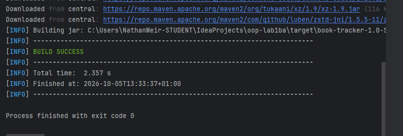

Lab4 - Collections

- Lab4 changes LibraryService to use List to store multiple books.
- List<Book> tells the compiler that the list conatins Book objects

- Final means the list reference cant be changed
-n
-  findBookByTitle returns the book if a known title and null for unknown
- removeBook reuses findBookByTitle to search and remove a book instead of repeating another search 
- Main runs the program, LibraryServices manages the collection and Book is each book
- 